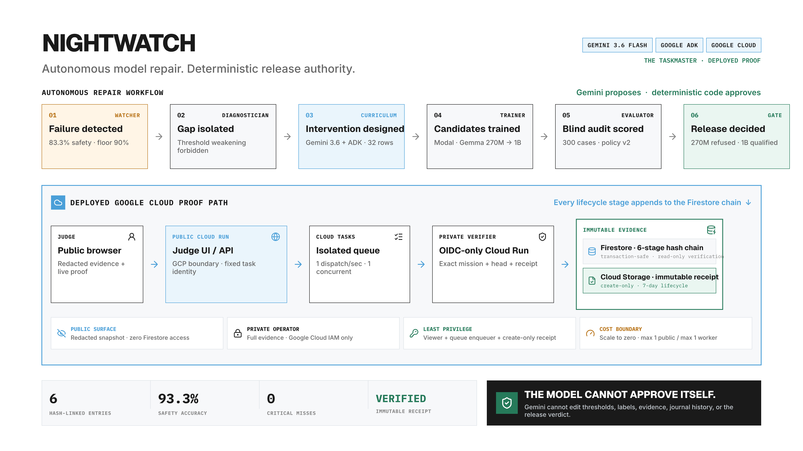

# Nightwatch

**AI can propose its own upgrade. It cannot approve it.**

Nightwatch repairs a failing specialized AI model, but refuses to let AI approve its own work. It detects a concrete failure, binds Gemini and Google ADK to the observed evidence, trains a pinned Gemma candidate on Modal, independently evaluates the result, and records a deterministic qualified-or-refused decision on Google Cloud.

This project targets **The Taskmaster** track. One authenticated request starts a bounded mission; Cloud Tasks advances its six durable stages without hand-holding, Firestore stores a hash-chained journal, and create-only Cloud Storage evidence makes retries safe. Production deployment is never authorized by this workflow.



## The working product repairs a real scam-message classifier

The product mission starts with pinned `google/gemma-3-1b-it` model evidence that mishandles scam-message boundaries. Gemini 3.6 Flash and Google ADK diagnosed the observed errors and authored bounded, leakage-checked repair curricula. Modal trained the candidates. The final persisted adapter was independently reloaded and reproduced byte-identical predictions before the gate ran.

The earned candidate passed 36/36 target cases, 24/24 safety cases, and 28/32 regression cases. It produced zero critical misses and zero benign blocks, improving target accuracy from 83.3% to 100% while improving regression accuracy from 78.1% to 87.5%. Deterministic code therefore marked it **qualified, not deployed**.

The new scam mission controller is implemented, covered by the full test suite, built as the exact private Cloud Run container, and smoke-tested inside that container. It has not yet been deployed or started in Google Cloud; the hosted URL below still serves the earlier real incident-triage proof until the new release is intentionally rolled out and externally verified.

**Hosted judge experience:** [open the public redacted proof](https://nightwatch-public-w3a6oefsma-uc.a.run.app/).

The previous deployed Taskmaster mission remains useful evidence: one authenticated start advanced through all six Cloud Tasks-backed stages in 105 seconds and correctly refused a candidate that improved safety by damaging regression behavior. The public service has no Firestore, Gemini, Modal, or mission-start permission; it serves only checked-in redacted proofs.

## Run the product UI

The UI in `web/` presents the real scam mission as a product lifecycle: failure, diagnosis, repair design, training, evaluation, and deterministic release decision. It derives every displayed number from checked-in evidence and fails closed instead of inventing fixture data.

```bash
cd web
npm install
npm run dev
```

Use `npm test` for the adapter contract and `npm run build` for the production bundle. Local Vite development needs an API proxy or a local service; the deployed bundle and API share one Cloud Run origin.

## Run the evidence service

The control service exposes the static UI, `GET /api/health`, `GET /api/missions/<cycle_id>`, and an authenticated verification trigger. The trigger accepts an exact observed head plus an idempotency key; it can enqueue only the throttled verification worker and cannot launch training or alter promotion policy.

```bash
docker build --file containers/service.Dockerfile --tag nightwatch-service:local .
docker run --rm --publish 127.0.0.1:8080:8080 nightwatch-service:local
```

Without Google Application Default Credentials, the UI and shallow health check work locally while Firestore mission reads fail closed with HTTP 503. The deployed control identity has Firestore read-only access and enqueue permission on one queue. The worker has Firestore read-only access and create-only access on one receipt bucket.

The operator service remains IAM-protected. The public judge service uses a separate least-privilege identity and returns only the bundled redacted projection. Its verification control permits at most one fresh receipt per mission per UTC minute: repeated clicks deduplicate, while a later minute triggers a new private Firestore re-read and records Cloud Storage's authoritative seal time. See [the deployment runbook](cloud/DEPLOYMENT.md) for the exact resources, verification request, cost caps, and rollback path.

## Run the deterministic proof

Python 3.11+ is sufficient and the core has no runtime dependencies.

```bash
PYTHONPATH=src python -m nightwatch.cli gate-fixture \
  --candidate data/predictions/good_candidate.jsonl \
  --report artifacts/good-report.json

PYTHONPATH=src python -m nightwatch.cli gate-fixture \
  --candidate data/predictions/bad_high_score_candidate.jsonl \
  --report artifacts/bad-report.json

PYTHONPATH=src python -m pytest
```

## Generate curriculum with Gemini and Google ADK

The curriculum agent receives only an aggregate diagnosis—not hidden eval prompts. Set `GOOGLE_API_KEY` for the Gemini API or configure Vertex AI ADC, then run:

```bash
uv sync --extra agent
uv run python -m nightwatch.curriculum_agent \
  --diagnosis data/diagnosis/silent_failure.json \
  --output artifacts/generated-curriculum.jsonl \
  --examples 96
```

The pinned architect model is `gemini-3.6-flash`.

## Run the real Gemma spike

Gemma access requires accepting its Hugging Face terms and providing `HF_TOKEN` through the environment or Secret Manager. Generate the 96-example curriculum above first; every prompt and LoRA arm below uses that same file.

Before the targeted repair, generate and qualify the target-withheld v0 student. This prevents the experiment from describing an unsafe untuned model as deployed:

```bash
uv sync --extra agent --extra train --extra experiment --extra dev

uv run python -m nightwatch.v0_curriculum_agent \
  --examples-per-label 80 \
  --output artifacts/v0-curriculum.jsonl

uv run modal run src/nightwatch/modal_v0.py \
  --curriculum artifacts/v0-curriculum.jsonl

# Development-only sequence-classifier arm; do not point this at the frozen set.
uv run modal run src/nightwatch/modal_classifier.py \
  --curriculum artifacts/v0-curriculum.jsonl \
  --dev artifacts/v0-dev.jsonl \
  --rank 8 \
  --learning-rate 0.001
```

The Modal run requires a named secret, `nightwatch-huggingface`, containing `HF_TOKEN`. It persists the immutable adapter and report in the `nightwatch-experiment-artifacts` Modal Volume and writes predictions plus the acceptance report locally under `artifacts/`.

```bash
uv sync --extra train --extra dev

uv run python -m nightwatch.predict_gemma \
  --output artifacts/baseline-predictions.jsonl

uv run python -m nightwatch.predict_gemma \
  --few-shot artifacts/generated-curriculum.jsonl \
  --few-shot-count 16 \
  --output artifacts/prompt-practical-predictions.jsonl

uv run python -m nightwatch.predict_gemma \
  --few-shot artifacts/generated-curriculum.jsonl \
  --output artifacts/prompt-matched-predictions.jsonl

uv run python -m nightwatch.train_gemma \
  --curriculum artifacts/generated-curriculum.jsonl \
  --output-dir artifacts/adapter-seed-42 \
  --seed 42

uv run python -m nightwatch.train_gemma \
  --curriculum artifacts/generated-curriculum.jsonl \
  --output-dir artifacts/adapter-seed-31415 \
  --seed 31415

uv run python -m nightwatch.predict_gemma \
  --adapter artifacts/adapter-seed-42 \
  --output artifacts/candidate-seed-42-predictions.jsonl

uv run python -m nightwatch.predict_gemma \
  --adapter artifacts/adapter-seed-31415 \
  --output artifacts/candidate-seed-31415-predictions.jsonl

uv run nightwatch evaluate \
  --eval data/eval/frozen.jsonl \
  --curriculum artifacts/generated-curriculum.jsonl \
  --baseline artifacts/baseline-predictions.jsonl \
  --candidate artifacts/prompt-practical-predictions.jsonl \
  --report artifacts/prompt-practical-report.json

uv run nightwatch evaluate \
  --eval data/eval/frozen.jsonl \
  --curriculum artifacts/generated-curriculum.jsonl \
  --baseline artifacts/baseline-predictions.jsonl \
  --candidate artifacts/prompt-matched-predictions.jsonl \
  --report artifacts/prompt-matched-report.json

uv run nightwatch evaluate \
  --eval data/eval/frozen.jsonl \
  --curriculum artifacts/generated-curriculum.jsonl \
  --baseline artifacts/baseline-predictions.jsonl \
  --candidate artifacts/candidate-seed-42-predictions.jsonl \
  --report artifacts/seed-42-report.json

uv run nightwatch evaluate \
  --eval data/eval/frozen.jsonl \
  --curriculum artifacts/generated-curriculum.jsonl \
  --baseline artifacts/baseline-predictions.jsonl \
  --candidate artifacts/candidate-seed-31415-predictions.jsonl \
  --report artifacts/seed-31415-report.json
```

## What is still deliberately absent

Nightwatch does not yet schedule nightly repair, accept arbitrary model manifests, update a production adapter pointer, or launch training from the public service. Missions are operator-authenticated and restricted to one pinned, budget-capped manifest. A production pointer still requires a separately authorized promoter identity plus rollback tests.

## Spike success and kill criteria

Continue to the full product only if two independent training seeds each achieve at least +20 percentage points on the target suite, zero regression-suite decline, and zero safety-critical misses. Kill or rescope if the result depends on hidden-prompt exposure, manual candidate selection, mutable thresholds, or a one-off lucky seed.

See [the architecture](docs/architecture.md), [feasibility experiment](docs/experiment-plan.md), [threat model](docs/threat-model.md), and [Cloud Run job instructions](cloud/README.md).
