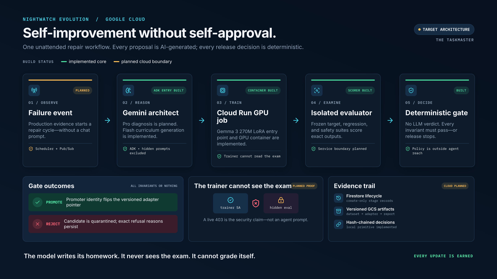

# Nightwatch Evolution

**AI can propose its own upgrade. It cannot approve it.**

Nightwatch is an autonomous release guardian for small production models. Gemini agents diagnose a failing behavior and design a targeted curriculum, Modal trains pinned Gemma candidates, and deterministic evaluation code promotes a candidate only when it clears fixed regression and safety policy.

This project targets **The Taskmaster** track: Nightwatch takes an entire model-repair workflow from observed failure to a promoted or rejected candidate without hand-holding.



## What works now

One real qualification mission is deployed on Google Cloud. Gemini 3.6 Flash and Google ADK generated a 32-example safety intervention; Modal trained pinned Gemma 3 270M and 1B candidates; a prediction-blind audit and independent adjudication produced policy v2; deterministic code refused the 270M candidate and qualified the 1B candidate without retraining after adjudication.

The qualified 1B candidate reached 86.25% regression accuracy, 93.3% safety accuracy, 70% target accuracy, and zero critical misses. It is **qualified, not deployed**, and the result is specific to the checked-in policy-v2 evidence—not a claim of universal model safety.

The six lifecycle stages are stored in Firestore as a transaction-safe SHA-256 chain. An IAM-protected Cloud Run service verifies and serves that chain to the operator UI. A separate public mode serves a checked-in, allowlisted redaction of that exact mission: it has no Firestore permission, exposes one mission and one content-derived verification receipt, and can enqueue only one stable proof task. The private worker re-verifies the live Firestore head asynchronously through Cloud Tasks and writes one immutable, create-only receipt to Cloud Storage. The live proof completed with one receipt; replaying the same task identity produced no second effect.

## Run the evidence logbook UI

The single-screen UI in `web/` fetches `nightwatch-v2-qualification` from the evidence API, validates the bounded chain again in the browser, and fails closed instead of replacing unavailable cloud evidence with fixture data.

```bash
cd web
npm install
npm run dev
```

Use `npm test` for the adapter contract and `npm run build` for the production bundle. Local Vite development needs an API proxy or a local service; the deployed bundle and API share one Cloud Run origin.

## Run the evidence service

The control service exposes the static UI, `GET /api/health`, `GET /api/missions/<cycle_id>`, and an authenticated verification trigger. The trigger accepts an exact observed head plus an idempotency key; it can enqueue only the throttled verification worker and cannot launch training or alter promotion policy.

```bash
docker build --file containers/service.Dockerfile --tag nightwatch-service:local .
docker run --rm --publish 127.0.0.1:8080:8080 nightwatch-service:local
```

Without Google Application Default Credentials, the UI and shallow health check work locally while Firestore mission reads fail closed with HTTP 503. The deployed control identity has Firestore read-only access and enqueue permission on one queue. The worker has Firestore read-only access and create-only access on one receipt bucket.

The operator service remains IAM-protected. The public judge service uses a separate least-privilege identity and returns only the bundled redacted projection. See [the deployment runbook](cloud/DEPLOYMENT.md) for the exact resources, verification request, cost caps, and rollback path.

## Run the deterministic proof

Python 3.11+ is sufficient and the core has no runtime dependencies.

```bash
PYTHONPATH=src python -m nightwatch.cli gate-fixture \
  --candidate data/predictions/good_candidate.jsonl \
  --report artifacts/good-report.json

PYTHONPATH=src python -m nightwatch.cli gate-fixture \
  --candidate data/predictions/bad_high_score_candidate.jsonl \
  --report artifacts/bad-report.json

PYTHONPATH=src python -m pytest
```

## Generate curriculum with Gemini and Google ADK

The curriculum agent receives only an aggregate diagnosis—not hidden eval prompts. Set `GOOGLE_API_KEY` for the Gemini API or configure Vertex AI ADC, then run:

```bash
uv sync --extra agent
uv run python -m nightwatch.curriculum_agent \
  --diagnosis data/diagnosis/silent_failure.json \
  --output artifacts/generated-curriculum.jsonl \
  --examples 96
```

The pinned architect model is `gemini-3.6-flash`; `gemini-3.5-flash` is the fallback if availability requires it.

## Run the real Gemma spike

Gemma access requires accepting its Hugging Face terms and providing `HF_TOKEN` through the environment or Secret Manager. Generate the 96-example curriculum above first; every prompt and LoRA arm below uses that same file.

Before the targeted repair, generate and qualify the target-withheld v0 student. This prevents the experiment from describing an unsafe untuned model as deployed:

```bash
uv sync --extra agent --extra train --extra experiment --extra dev

uv run python -m nightwatch.v0_curriculum_agent \
  --examples-per-label 80 \
  --output artifacts/v0-curriculum.jsonl

uv run modal run src/nightwatch/modal_v0.py \
  --curriculum artifacts/v0-curriculum.jsonl

# Development-only sequence-classifier arm; do not point this at the frozen set.
uv run modal run src/nightwatch/modal_classifier.py \
  --curriculum artifacts/v0-curriculum.jsonl \
  --dev artifacts/v0-dev.jsonl \
  --rank 8 \
  --learning-rate 0.001
```

The Modal run requires a named secret, `nightwatch-huggingface`, containing `HF_TOKEN`. It persists the immutable adapter and report in the `nightwatch-experiment-artifacts` Modal Volume and writes predictions plus the acceptance report locally under `artifacts/`.

```bash
uv sync --extra train --extra dev

uv run python -m nightwatch.predict_gemma \
  --output artifacts/baseline-predictions.jsonl

uv run python -m nightwatch.predict_gemma \
  --few-shot artifacts/generated-curriculum.jsonl \
  --few-shot-count 16 \
  --output artifacts/prompt-practical-predictions.jsonl

uv run python -m nightwatch.predict_gemma \
  --few-shot artifacts/generated-curriculum.jsonl \
  --output artifacts/prompt-matched-predictions.jsonl

uv run python -m nightwatch.train_gemma \
  --curriculum artifacts/generated-curriculum.jsonl \
  --output-dir artifacts/adapter-seed-42 \
  --seed 42

uv run python -m nightwatch.train_gemma \
  --curriculum artifacts/generated-curriculum.jsonl \
  --output-dir artifacts/adapter-seed-31415 \
  --seed 31415

uv run python -m nightwatch.predict_gemma \
  --adapter artifacts/adapter-seed-42 \
  --output artifacts/candidate-seed-42-predictions.jsonl

uv run python -m nightwatch.predict_gemma \
  --adapter artifacts/adapter-seed-31415 \
  --output artifacts/candidate-seed-31415-predictions.jsonl

uv run nightwatch evaluate \
  --eval data/eval/frozen.jsonl \
  --curriculum artifacts/generated-curriculum.jsonl \
  --baseline artifacts/baseline-predictions.jsonl \
  --candidate artifacts/prompt-practical-predictions.jsonl \
  --report artifacts/prompt-practical-report.json

uv run nightwatch evaluate \
  --eval data/eval/frozen.jsonl \
  --curriculum artifacts/generated-curriculum.jsonl \
  --baseline artifacts/baseline-predictions.jsonl \
  --candidate artifacts/prompt-matched-predictions.jsonl \
  --report artifacts/prompt-matched-report.json

uv run nightwatch evaluate \
  --eval data/eval/frozen.jsonl \
  --curriculum artifacts/generated-curriculum.jsonl \
  --baseline artifacts/baseline-predictions.jsonl \
  --candidate artifacts/candidate-seed-42-predictions.jsonl \
  --report artifacts/seed-42-report.json

uv run nightwatch evaluate \
  --eval data/eval/frozen.jsonl \
  --curriculum artifacts/generated-curriculum.jsonl \
  --baseline artifacts/baseline-predictions.jsonl \
  --candidate artifacts/candidate-seed-31415-predictions.jsonl \
  --report artifacts/seed-31415-report.json
```

## What is still deliberately absent

Nightwatch does not yet schedule nightly repair, update a production adapter pointer, or launch training from the public service. The asynchronous judge path re-verifies completed evidence; it does not pretend to retrain the model. A production pointer still requires a separately authorized promoter identity plus rollback tests.

## Spike success and kill criteria

Continue to the full product only if two independent training seeds each achieve at least +20 percentage points on the target suite, zero regression-suite decline, and zero safety-critical misses. Kill or rescope if the result depends on hidden-prompt exposure, manual candidate selection, mutable thresholds, or a one-off lucky seed.

See [the architecture](docs/architecture.md), [feasibility experiment](docs/experiment-plan.md), [threat model](docs/threat-model.md), and [Cloud Run job instructions](cloud/README.md).
