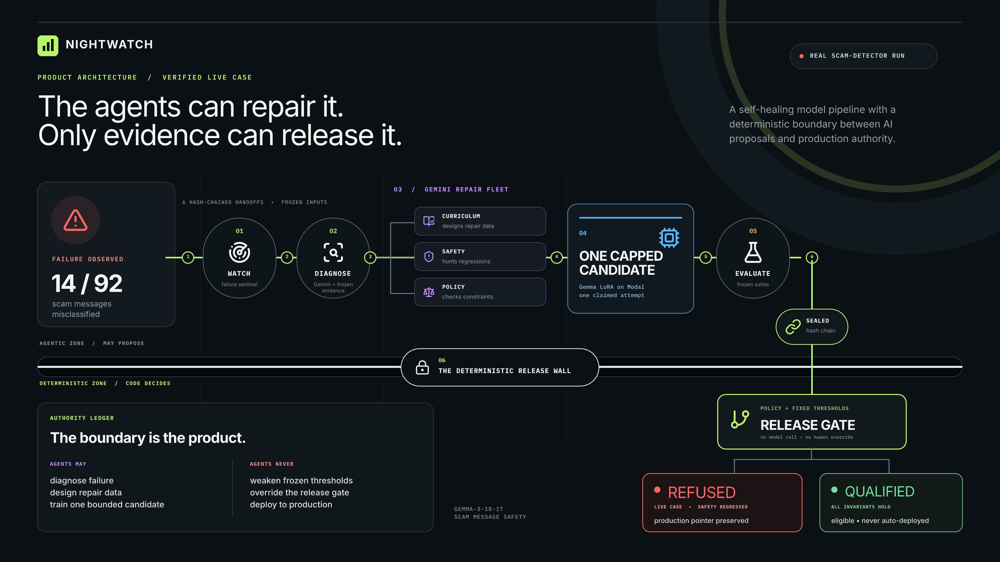
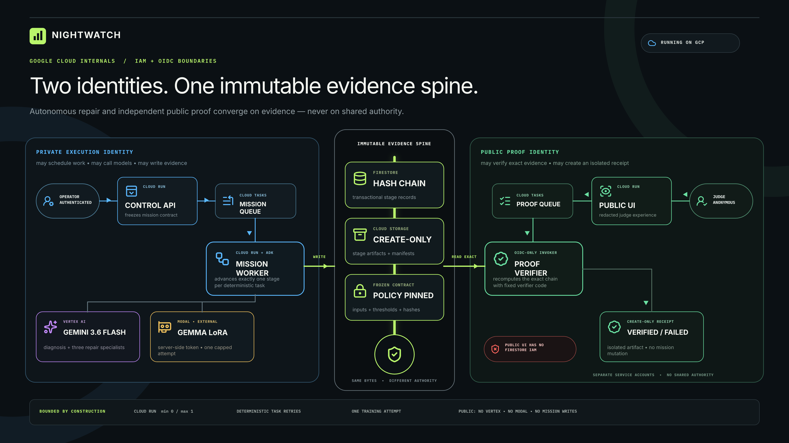

<p align="center">
  
</p>

<p align="center"><strong>Autonomous model repair. Deterministic release authority.</strong></p>

<p align="center">
  <a href="https://nightwatch-public-w3a6oefsma-uc.a.run.app/">Live judge experience</a>
  · <a href="https://youtu.be/XNeef08JqI4">Demo video</a>
  · <a href="docs/architecture.md">Architecture</a>
  · <a href="docs/threat-model.md">Threat model</a>
  · <a href="cloud/DEPLOYMENT.md">Deployment evidence</a>
</p>

> **Three agents designed the repair. The gate found seven dangerous misses.** Nightwatch delegated three bounded repair briefs, sealed each specialist output independently, trained once, and refused the unsafe candidate.

Nightwatch is an autonomous repair line for specialized AI models. One authenticated request starts a bounded mission that detects a failure, diagnoses it with Gemini, asks Google ADK specialists to design a repair, trains a pinned Gemma candidate, evaluates frozen evidence, and records a deterministic release decision. The model can propose an upgrade; it cannot approve one.

> **Build status:** the public case study and authenticated self-service product are deployed and verified on Google Cloud. The latest real model + dataset mission completed all six stages on August 20, 2026 and correctly ended `refused_not_deployed`; its three specialist artifacts have distinct immutable hashes, while the judge service remains isolated from operator authority.

**Hackathon:** [All Things Agentic Hackathon](https://allthingsagentichackathon.devpost.com/)<br>
**Track:** The Taskmaster<br>
**Core stack:** Gemini 3.6 Flash · Google ADK · Cloud Run · Cloud Tasks · Firestore · Cloud Storage · Vertex AI · Gemma 3 · Modal<br>
**Submission pack:** [Hosted project](https://nightwatch-public-w3a6oefsma-uc.a.run.app/) · [3:13 demo](https://youtu.be/XNeef08JqI4) · [Source code](https://github.com/gowtham0992/Nightwatch) · [Spin-up instructions](#run-the-public-product-locally) · [Architecture](docs/architecture.md) · [Google Cloud proof](cloud/DEPLOYMENT.md)<br>
**Bonus:** Gemma 3 is the pinned student model repaired and evaluated by Nightwatch · [Public X launch post](https://x.com/GothamSarves/status/2090937163215147229) with `#AllThingsAgenticHackathon`

## Watch Nightwatch run the complete repair mission

<p align="center">
  <a href="https://www.youtube.com/watch?v=XNeef08JqI4">
    
  </a>
</p>

<p align="center">
  <a href="https://www.youtube.com/watch?v=XNeef08JqI4"><strong>Watch the 3:13 demo</strong></a> · Real agents · Real Google Cloud execution · Deterministic release decision
</p>

## This is a Taskmaster, not a chatbot

The friction is operational: when a specialized model fails, a team must reproduce the failure, understand it, prepare corrective data, spend compute on a candidate, protect old behavior, decide whether to release, and preserve an audit trail. Those steps are slow, easy to bias after seeing results, and dangerous to compress into one prompt.

Nightwatch owns that workflow from trigger to decision:

| Stage | Accountable worker | Real action | Durable evidence |
|---|---|---|---|
| 1. Watch | Watcher | Evaluates the selected baseline on the uploaded evidence and proves a repairable failure exists | Immutable baseline predictions and Firestore `created` entry |
| 2. Diagnose | Gemini/ADK diagnostician | Sees bounded failure evidence and isolates repair families | Create-only diagnosis artifact |
| 3. Design | Three ADK curriculum specialists | Author parallel, targeted repair examples | Three independently sealed specialist artifacts plus aggregate validation and leakage report |
| 4. Train | Trainer | Launches one pinned Gemma LoRA training call on Modal | Call claim, adapter, predictions, training report |
| 5. Evaluate | Deterministic evaluator | Scores target, safety, regression, recall, coverage, and critical misses | Immutable evaluation report |
| 6. Decide | Release gate | Applies versioned code-only invariants | `qualified_not_deployed` or `refused_not_deployed` |

Cloud Tasks advances exactly one durable stage per request. A retry resumes from immutable evidence instead of repeating completed Gemini or training work. No human selects the favorable candidate, edits a threshold, or presses “approve” midway through the run.

## Three real outcomes, one fixed release boundary

The public experience presents three separate, evidence-backed cases. Replaying them starts no compute or operator action.

### Case 1 — Unsafe repair refused

Mission `nightwatch-live-a786ae339253954371f524f8` began with 14 baseline errors across 92 cases. Three Google ADK specialists independently sealed 10 target-repair rows, 12 safety-boundary rows, and 9 regression-guard rows with distinct SHA-256 identities. One Modal call trained the only permitted candidate in 3.3019 measured training seconds.

The candidate then regressed: target accuracy fell from 83.3% to 75.0%, safety accuracy from 95.8% to 45.8%, and regression accuracy from 78.1% to 56.3%. It missed seven critical cases and failed four fixed invariants. Deterministic code refused it; production remained untouched.

### Case 2 — Headline success, hidden regression

Unattended Google Cloud mission `nightwatch-live-89e73407c43d525c4bc19272` looked excellent until Nightwatch checked protected behavior:

| Protected measure | Baseline | Candidate | Gate result |
|---|---:|---:|---|
| Target accuracy | 63.9% | **100.0%** | Passed |
| Safety accuracy | 95.8% | **100.0%** | Passed |
| Routine-message recall | **87.5%** | 75.0% | **Failed** |
| Critical misses | 0 | 0 | Passed |
| Final release state | — | — | **Refused, not deployed** |

The gate caught the hidden routine-message regression and kept the release boundary locked. The retained baseline and later full-coverage reproduction are distinct evidence versions; their exact coverage and provenance are documented in [the scam-safety evidence archive](artifacts/scam-safety/README.md).

### Case 3 — Qualified, never automatically deployed

The comparison case passed every fixed invariant and ended `qualified_not_deployed`. Qualification records that the candidate crossed the evidence boundary; it never mutates a production model pointer.

Open the [live judge experience](https://nightwatch-public-w3a6oefsma-uc.a.run.app/) to inspect all three. The verified Cloud Run journal replays on a nine-node execution graph, exposing every specialist assignment, row count, immutable artifact hash, and downstream handoff. The bundled public projection excludes raw examples, case identities, dataset identity, model revision, Modal call IDs, and credentials.

## Architecture

Nightwatch is easiest to understand in two layers. The product view shows the autonomous repair mission and the hard boundary between AI-authored proposals and code-owned release authority.



The Google Cloud view shows how separate services, queues, identities, and evidence stores enforce that boundary in the deployed system.



There are two deliberately separate paths:

1. **Private autonomous execution.** An IAM-protected Cloud Run interface accepts a bounded Gemma checkpoint, a CSV/JSONL evaluation dataset, explicit field mappings, release thresholds, and compute limits. It canonicalizes the dataset, freezes a content-addressed contract, and enqueues only that contract ID. A private, OIDC-only worker advances six idempotent stages through Cloud Tasks. Gemini 3.6 Flash runs through Vertex AI and Google ADK; Modal performs baseline evaluation and the single bounded Gemma training attempt. Firestore and Cloud Storage retain the evidence.
2. **Public, independently verifiable proof.** The judge UI runs on a different public Cloud Run identity. It serves a checked-in redacted projection and has no Firestore, Gemini, Modal, or mission-launch permission. A separate fixed-purpose verifier can re-read the exact private chain and create—but never overwrite—an isolated receipt.

Every interaction has a failure policy. Stage task IDs are deterministic, Firestore appends are transactional, external effects are cycle-and-stage keyed, artifacts are create-only, queue attempts are bounded, and malformed evidence fails closed.

## Hackathon requirements, explicitly covered

| Requirement | Nightwatch implementation |
|---|---|
| **Gemini 3.5 or newer** | Gemini **3.6 Flash** diagnoses observed failures and authors bounded repair curricula through Vertex AI. Flash is used instead of Pro to keep the common path inexpensive. |
| **Google agent framework** | **Google ADK** provides the diagnostician and parallel curriculum-authoring specialists. Their structured output is schema-validated before it can affect training. |
| **Google Cloud service** | **Cloud Run** hosts the public, private, worker, and verifier services; **Cloud Tasks** provides durable orchestration; **Firestore** stores the journal; **Cloud Storage** stores immutable artifacts and receipts; **Vertex AI** serves Gemini. |
| **Autonomous action beyond chat** | One request advances detection → diagnosis → repair design → training → evaluation → release decision without hand-holding. There is no chat interface. |
| **Hosted project** | The [public Cloud Run experience](https://nightwatch-public-w3a6oefsma-uc.a.run.app/) is available without credentials and exposes no operator capability. |
| **Demo video** | The public [3:13 product demo](https://youtu.be/XNeef08JqI4) explains the problem and value, shows the autonomous mission and release gate, and includes visible Google Cloud deployment proof. |
| **Source repository** | This repository contains the application, tests, deployment configuration, retained public evidence, and MIT license. |
| **Additional Google AI model** | The student is the pinned `google/gemma-3-1b-it` model, trained as a LoRA candidate. This satisfies the optional Gemma integration bonus. |
| **Reproducibility** | Local product, test, container, and Google Cloud deployment instructions are below and in the [deployment runbook](cloud/DEPLOYMENT.md). |
| **Architecture and proof** | This repository includes the architecture diagram, immutable public evidence, exact release revisions, rollback results, and a fresh verification receipt. |
| **Data and learnings** | The [data provenance](#evidence-and-data-provenance) and [experiment findings](#what-the-experiments-taught-us) are documented with the retained evidence versions that support them. |

Nightwatch demonstrates autonomous operational utility, explicit failure discipline, and deployed Google Cloud execution. It is entered only in **The Taskmaster** track.

## The execution graph is inspectable

The UI exposes nine accountable nodes without pretending every box is an LLM:

- four Gemini/ADK roles: one diagnostician and three bounded curriculum specialists;
- a watcher and policy validator that freeze scope and reject invalid evidence;
- a trainer whose external call is idempotent and budget-capped;
- an evaluator that cannot modify training data;
- a deterministic release gate with no model call at all.

Selecting a node shows its input, output hash, authority, and downstream handoff. Green means that worker completed its assigned job; a refused release gate is rendered as blocked, not successful.

## Safety is enforced outside the model

Gemini receives only the evidence required for its role. It cannot read the sealed evaluation set or modify labels, gate thresholds, mission history, budgets, or deployment state.

The scam-message gate is fixed before training and requires all of the following:

- at least 15 percentage points of target-suite improvement;
- no more than two points of overall regression loss;
- at least 95% recall on safety cases that must be blocked;
- zero critical misses;
- no increase in benign blocking;
- no decline in protected regression-label recall;
- exactly one valid prediction for every sealed case.

The final verdict is produced by deterministic Python, not Gemini. A candidate can only become `qualified_not_deployed`; actual production deployment is intentionally outside Nightwatch’s authority.

## Security and cost boundaries

The public and private services do not share authority simply because they share code.

| Boundary | Enforcement |
|---|---|
| Public judge surface | Separate identity; redacted bundled evidence; no Firestore, Vertex AI, Modal, or mission-start access |
| Private operator | Google Cloud IAM authentication; content-addressed contract; server-derived cycle ID; allowlisted queue only |
| Workers | OIDC-only Cloud Run invocation; one-purpose service accounts; least-privilege IAM |
| Evidence | SHA-256 hash chain in Firestore; create-only Cloud Storage artifacts and receipts |
| Inputs | CSV/JSONL only; 2 MB, 10,000-row, 32-column, and cell-size caps; pinned model revisions and registered adapters; no URLs, code, shell, storage URI, or runtime selection |
| Browser | CSP, frame denial, no-referrer, no-sniff, and no-store API responses |
| Secrets | Environment or managed secret injection only; `.env*`, credentials, adapters, and generated artifacts are ignored |
| Spend | Gemini Flash, scale-to-zero Cloud Run services, maximum instance caps, one concurrent mission stage, bounded retries, one training attempt, and a 20-GPU-minute manifest ceiling |

The deployed configuration uses minimum instances of zero. The public service and workers are capped at one instance; the authenticated evidence service is capped at two. Detailed resource identities, immutable image digests, rollback targets, and queue limits are recorded in [cloud/DEPLOYMENT.md](cloud/DEPLOYMENT.md).

## Run the public product locally

The fastest path needs Docker and no cloud credentials:

```bash
git clone https://github.com/gowtham0992/Nightwatch.git
cd Nightwatch

docker build --file containers/service.Dockerfile --tag nightwatch:local .
docker run --rm \
  --publish 127.0.0.1:8080:8080 \
  --env NIGHTWATCH_PUBLIC_MODE=1 \
  nightwatch:local
```

Open [http://127.0.0.1:8080](http://127.0.0.1:8080). This starts the same fail-closed public mode used for judging, backed only by checked-in, integrity-validated evidence. Fresh private verification receipts require the deployed Google Cloud verifier and are not emulated locally.

## Run the tests and build from source

Prerequisites: Python 3.11+, [uv](https://docs.astral.sh/uv/), Node.js 22+, and npm.

```bash
git clone https://github.com/gowtham0992/Nightwatch.git
cd Nightwatch

uv sync --extra dev
uv run pytest

cd web
npm ci
npm test
npm run build
```

The Python suite covers gates, journal integrity, task idempotency, storage preconditions, service boundaries, public redaction, verification, mission orchestration, and the real scam-safety evidence contract. The frontend suite verifies the mission adapter and fails closed when evidence is incomplete or inconsistent.

To exercise the small deterministic gate fixture without any model or cloud call:

```bash
uv run python -m nightwatch.cli gate-fixture \
  --candidate data/predictions/good_candidate.jsonl \
  --report artifacts/good-report.json

uv run python -m nightwatch.cli gate-fixture \
  --candidate data/predictions/bad_high_score_candidate.jsonl \
  --report artifacts/bad-report.json
```

The second fixture is intentionally high-scoring but unsafe; the gate must refuse it.

## Run a live agent or deploy to Google Cloud

A live mission has external effects and can spend Gemini and Modal credits. Do not place tokens in the repository.

1. Accept the Gemma model terms and provide `HF_TOKEN` to the named Modal secret `nightwatch-huggingface`.
2. Authenticate Google Cloud with Application Default Credentials and enable Vertex AI, Cloud Run, Cloud Tasks, Firestore, Cloud Storage, Artifact Registry, Cloud Build, and IAM. Configure the private ADK worker with `GOOGLE_GENAI_USE_VERTEXAI=TRUE`, `GOOGLE_CLOUD_PROJECT=YOUR_PROJECT_ID`, and an approved `GOOGLE_CLOUD_LOCATION`; its service account requires Vertex AI invocation permission. The deployed Nightwatch worker uses `global`.
3. Install the live dependencies with `uv sync --extra agent --extra experiment --extra service --extra dev`.
4. Create the separate runtime and OIDC invoker service accounts described in [cloud/DEPLOYMENT.md](cloud/DEPLOYMENT.md).
5. Build with [cloud/service-build.yaml](cloud/service-build.yaml) and [cloud/mission-build.yaml](cloud/mission-build.yaml), deploy immutable image digests, then enable only the private operator route.
   Set `NIGHTWATCH_MODAL_CONNECTED=1` on the private UI only after the worker identity has working server-side Modal credentials; never copy those credentials into the browser-facing service.
6. Keep Cloud Run minimum instances at zero, preserve the documented maximum-instance and queue caps, and set a billing alert before launching a mission.
7. From the authenticated UI, select a registered Gemma baseline, upload a real CSV/JSONL evaluation dataset, map its fields, freeze the contract, and run one mission. Record the Cloud Run URL, baseline scan, Cloud Tasks progression, Modal calls, terminal Firestore head, and verification receipt.

The exact deployed topology, resource names, release digests, IAM boundaries, verification request, and rollback procedure live in the [deployment runbook](cloud/DEPLOYMENT.md). The public service must never receive the private service’s environment variables or IAM roles.

## Evidence and data provenance

Nightwatch’s scam-message corpus is newly authored for this project and separated by purpose:

- curriculum rows are available to training;
- development rows guide bounded repair;
- sealed evaluation rows are never shown to Gemini or used for candidate selection;
- canonical exact overlap between curriculum and evaluation is rejected;
- every retained artifact records its content hash.

No customer messages or personal data are used. The base student is Google’s Gemma 3 1B instruction-tuned checkpoint at the immutable revision recorded in [data/scam_safety/mission.json](data/scam_safety/mission.json).

## What the experiments taught us

1. **A better aggregate score can still be an unsafe release.** The live candidate reached 100% on target and safety suites while losing 12.5 points of routine-message recall.
2. **The evaluator must be organizationally and technically separate from the repair agents.** Otherwise the same system can optimize and reinterpret its own test.
3. **Retry safety matters as much as model quality in autonomous workflows.** A duplicated task must not create a second Gemini call, training run, or receipt.
4. **Public proof should not require public authority.** Judges can inspect and freshly verify the evidence without gaining access to Firestore or the mission launcher.

## Repository map

```text
src/nightwatch/       Mission state machine, agents, gates, journals, services
web/                  React/Vite judge and authenticated operator interface
data/scam_safety/     Mission contract and separated scam-message evidence
artifacts/            Retained public proofs and reproducible evaluation records
containers/           Digest-pinned service and worker images
cloud/                Build configs, lifecycle policies, and deployment runbook
docs/                 Architecture, threat model, mission design, evaluation record
tests/                Python behavior, security, persistence, and orchestration tests
```

## Deliberate limits

Nightwatch accepts evaluation data, not arbitrary programs. The self-service path is limited to registered Gemma/PEFT classifier adapters, pinned model revisions, CSV or JSONL datasets, explicit target/regression/safety suites, an approved hyperparameter grid, one training attempt, and a 20-GPU-minute ceiling. It does not accept URLs, arbitrary model IDs, user code, storage locations, runtime choices, open-ended optimization loops, or deployment targets, and it never updates a production adapter pointer. Those are product safety boundaries, not missing demo controls.

The system proves autonomous repair and qualification—not universal model safety. A future production version would add tenant isolation, an independently authorized deployment service, shadow rollout, monitored rollback, and a human-owned policy-version process.

## License

Nightwatch is released under the [MIT License](LICENSE).

---

Built for the [All Things Agentic Hackathon](https://allthingsagentichackathon.devpost.com/) using Gemini, Google ADK, Google Cloud, and Gemma. Official requirements and resources are available on the hackathon’s [Resources](https://allthingsagentichackathon.devpost.com/resources), [FAQ](https://allthingsagentichackathon.devpost.com/details/faqs), and [Rules](https://allthingsagentichackathon.devpost.com/rules) pages.
