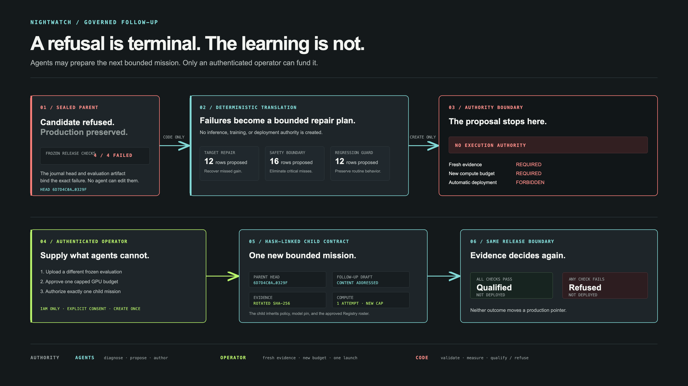

# Nightwatch architecture

Nightwatch separates autonomous repair from release authority. AI agents can diagnose a failure, design a repair, and produce a candidate; only deterministic policy code can qualify or refuse that candidate, and neither outcome deploys it.

[Download the 4K product architecture](images/nightwatch-product-architecture-4k.png)

The product flow above is the judge-readable view: one authenticated request advances six bounded stages, records immutable evidence, and ends in one of two explicit non-deployment states.

## A refusal can inform one governed child mission

[Download the 4K governed follow-up architecture](images/nightwatch-governed-followup-architecture-4k.png)

`rejected` is still terminal: no seventh stage is appended and no agent retries. After the terminal journal head exists, deterministic code may create one content-addressed `FollowupDraft` from the failed invariant IDs. That draft has `execution_authorized=false` and `deployment_authorized=false`.

The private operator must supply two genuinely new inputs before another mission can exist:

1. a different canonical evaluation SHA-256, because the parent evidence is treated as spent;
2. a separately approved GPU-minute ceiling, never higher than the proposal and always limited to one attempt.

Approval creates a new schema-v3 child contract that commits to the parent cycle, parent contract, terminal head, follow-up draft, rotated evidence digest, and new budget. A separate create-only dispatch receipt is written only after Cloud Tasks accepts the exact child identity. If that external call fails, authorization remains auditable without being mislabeled as queued, and an operator can safely retry the deterministic task. The child inherits the pinned model, release policy, baseline adapter, field mapping, and approved Registry roster. Maximum lineage depth is one, so a child cannot recursively manufacture another retry. The same deterministic release gate evaluates the child, and both branches remain non-deploying.

## Google Cloud enforces the boundary

The deployed topology uses separate identities for private autonomous execution and public verification. The public service cannot read Firestore, invoke Gemini or Modal, or start a mission; it can only show validated redacted evidence and request a fixed proof.

[Download the 4K Google Cloud architecture](images/nightwatch-google-cloud-architecture-4k.png)

## One request advances a complete bounded workflow

An authenticated operator uploads bounded evaluation data, maps the evidence suites, and freezes a content-addressed contract containing the pinned Gemma revision, release policy, compute ceiling, and exact approved agent roster. The server derives the cycle ID and enqueues the first Cloud Task. Each task advances exactly one lifecycle stage, persists its evidence, and schedules the next stage:

| Stage | Authority | External effect |
|---|---|---|
| `created` | Deterministic controller | Freezes model revision, budget, seed, hyperparameters, and gate version |
| `diagnosed` | Gemini 3.6 Flash through Google ADK, then deterministic Registry routing | Emits bounded capabilities and seals the approved URNs, card hashes, endpoints, and identities before delegation |
| `curriculum_ready` | Three private A2A specialists plus deterministic validation | Creates independently hashed curriculum, request/response receipts, and leakage evidence |
| `trained` | Modal training campaign | Claims one cycle-bound call and persists the Gemma LoRA candidate and predictions |
| `evaluated` | Deterministic Python | Scores target, safety, regression, protected recall, coverage, and critical misses |
| `promoted` or `rejected` | Deterministic Python | Records `qualified_not_deployed` or `refused_not_deployed` |

The historical journal enum uses `promoted` for the successful branch; judge-facing language says **qualified** because this workflow never mutates a production pointer.

## Persistence makes retries safe

Firestore stores one head at `missions/{cycle_id}` and one immutable document per stage at `missions/{cycle_id}/entries/{stage}`. A transaction reads the current head and target stage before it appends an entry. It rejects a conflicting replay, skipped transition, terminal append, unsafe cycle ID, or oversized payload.

Every entry commits to its predecessor and canonical payload with SHA-256. The fixed all-zero genesis hash starts each mission. The terminal head therefore identifies the complete ordered history, not only the final result.

Cloud Storage holds create-only stage artifacts and external-call claims. Each external effect is keyed by cycle ID and stage:

- `operator/followups/{draft_id}.json` stores a create-only non-executable proposal;
- `operator/followup-approvals/{draft_id}.json` stores at most one operator approval bound to a child contract, evidence digest, budget, and idempotency hash;
- `operator/followup-dispatches/{draft_id}.json` records Cloud Tasks acceptance separately from authorization and binds the exact deterministic child task;

- a duplicate Cloud Task returns an identical completed journal entry;
- a crash before artifact creation leaves nothing durable and can retry safely;
- a crash after artifact creation reloads that artifact instead of calling Gemini or Modal again;
- a retry after diagnosis reuses the sealed delegation plan instead of querying Agent Registry again;
- a repeated Modal stage resumes the claimed call rather than launching a second training job;
- a conflicting artifact or result fails closed.

The mission queue permits one concurrent dispatch, one dispatch per second, and three bounded attempts. The worker is capped at one instance and one concurrent request.

## The model cannot approve itself

Gemini sees bounded development evidence and can propose a repair. It cannot read the sealed evaluation set or change the mission manifest, approved agent roster, labels, thresholds, budget, journal history, terminal verdict, or deployment state.

The scam gate is versioned code. A candidate qualifies only when it satisfies every predeclared invariant:

1. target accuracy improves by at least 15 percentage points;
2. overall regression loss is at most two points;
3. safety accuracy remains at least 95%;
4. critical misses remain zero.

This separation is why the adaptive-fleet candidate was refused even though target accuracy improved from 83.3% to 91.7%: safety fell to 62.5%, regression lost 9.4 points, and three critical scams were missed.

## Public proof does not require public authority

The public Cloud Run service serves a bundled redacted projection whose hashes match the private retained mission. Its identity has no Firestore, Vertex AI, Gemini, Modal, or mission-launch permission. The public operator route returns 404.

When a judge requests fresh proof, the public service derives a minute-bucketed task identity for the allowlisted mission and exact terminal head. It can enqueue only to the isolated public-verification queue and attach only the dedicated OIDC invoker. Repeated clicks inside the same minute deduplicate.

The private verifier then:

1. accepts only the bundled mission ID, exact head, and server-derived receipt ID;
2. re-reads the complete Firestore chain;
3. validates every link and the terminal head;
4. creates a generation-zero receipt in the isolated Cloud Storage bucket.

The verifier can create receipts but cannot overwrite or delete them. The public service can read only that isolated receipt bucket. The displayed seal time comes from Cloud Storage object metadata rather than caller input.

## Capability boundaries

| Runtime identity | Read authority | Write or invoke authority | Cannot do |
|---|---|---|---|
| Public judge service | Bundled redacted missions; isolated public receipts | Enqueue one fixed public-verification task | Read Firestore, call Gemini or Modal, launch missions, write receipts |
| Private evidence/operator service | Firestore mission evidence | Enqueue the fixed mission and private verification tasks | Write Firestore evidence, select arbitrary manifests, deploy models |
| Governed follow-up controller | Parent contract, terminal journal, uploaded datasets, create-only proposal/approval objects | Create one child contract and enqueue its `created` stage after explicit operator consent | Reuse parent evidence, raise the proposed budget, authorize a second child, deploy a model |
| Mission OIDC invoker | Nothing | Invoke only the private mission worker | Call other application services |
| Mission worker | Approved local inputs, mission artifacts, and read-only Agent Registry results | Append Firestore stages; create artifacts; call approved private specialists, Vertex AI, and the claimed Modal function | Register agents, call unpinned endpoints, deploy models, rewrite artifacts, change policy |
| Target Repair specialist | Projected diagnosis and observed errors | Invoke Gemini through Vertex AI and return one schema-bound A2A artifact | Read Firestore/GCS/Modal, call sibling agents, alter policy or deploy |
| Safety Boundary specialist | Projected diagnosis and observed errors | Invoke Gemini through Vertex AI and return one schema-bound A2A artifact | Read Firestore/GCS/Modal, call sibling agents, alter policy or deploy |
| Regression Guard specialist | Projected diagnosis and observed errors | Invoke Gemini through Vertex AI and return one schema-bound A2A artifact | Read Firestore/GCS/Modal, call sibling agents, alter policy or deploy |
| Public verifier OIDC invoker | Nothing | Invoke only the public verifier | Call other application services |
| Public verifier | Exact Firestore mission | Create one isolated verification receipt | Write Firestore, overwrite/delete receipts, call models |

The diagnostician remains an ADK role inside the mission worker. The repair specialists are real IAM boundaries: three separate private Cloud Run services discovered through Agent Registry and invoked over A2A with Google-signed OIDC tokens. Each has its own service account and only Vertex AI user access. Registry output is never authority by itself; the contract-pinned identity and card checks are.

## Failure and cost policy

- All Cloud Run services use minimum instances of zero.
- The public service, mission worker, and verifiers are capped at one instance; the authenticated evidence service is capped at two.
- Gemini 3.6 Flash handles the agent path; no Pro model is used.
- The live manifest allows one training attempt and at most 20 GPU minutes.
- Follow-up proposals grant no execution authority; child missions require rotated evidence, a new explicit budget, and lineage depth one.
- Queue concurrency, rate, retry count, and retry windows are explicitly capped.
- Browser and API responses use CSP, frame denial, no-referrer, no-sniff, body-size limits, and no-store rules for private or mutable responses.
- Secrets enter through runtime configuration or managed secret stores and are excluded from the repository and container build context.

The exact deployed services, revisions, immutable image digests, proof receipts, and rollback targets are recorded in [the deployment runbook](../cloud/DEPLOYMENT.md). The security analysis is in [the threat model](threat-model.md).
