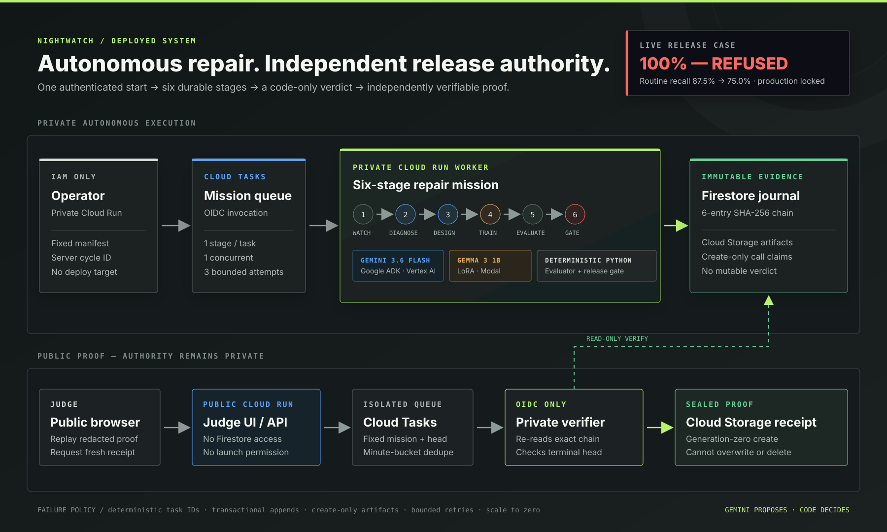

# Nightwatch deployed architecture

Nightwatch separates autonomous repair, deterministic release authority, and public proof. The private mission path can call Gemini and Modal but cannot deploy a model. The public judge path can request an independent verification but cannot read Firestore, invoke a model, start a mission, or alter evidence.

## One request advances a complete bounded workflow

An authenticated operator starts the fixed `scam-safety-live-1b-v1` manifest. The server derives the cycle ID and enqueues the first Cloud Task. Each task advances exactly one lifecycle stage, persists its evidence, and schedules the next stage:

| Stage | Authority | External effect |
|---|---|---|
| `created` | Deterministic controller | Freezes model revision, budget, seed, hyperparameters, and gate version |
| `diagnosed` | Gemini 3.6 Flash through Google ADK | Produces one schema-bound repair plan from observed failures |
| `curriculum_ready` | Parallel Gemini/ADK specialists plus deterministic validation | Creates targeted curriculum and leakage evidence |
| `trained` | Modal training campaign | Claims one cycle-bound call and persists the Gemma LoRA candidate and predictions |
| `evaluated` | Deterministic Python | Scores target, safety, regression, protected recall, coverage, and critical misses |
| `promoted` or `rejected` | Deterministic Python | Records `qualified_not_deployed` or `refused_not_deployed` |

The historical journal enum uses `promoted` for the successful branch; judge-facing language says **qualified** because this workflow never mutates a production pointer.

## Persistence makes retries safe

Firestore stores one head at `missions/{cycle_id}` and one immutable document per stage at `missions/{cycle_id}/entries/{stage}`. A transaction reads the current head and target stage before it appends an entry. It rejects a conflicting replay, skipped transition, terminal append, unsafe cycle ID, or oversized payload.

Every entry commits to its predecessor and canonical payload with SHA-256. The fixed all-zero genesis hash starts each mission. The terminal head therefore identifies the complete ordered history, not only the final result.

Cloud Storage holds create-only stage artifacts and external-call claims. Each external effect is keyed by cycle ID and stage:

- a duplicate Cloud Task returns an identical completed journal entry;
- a crash before artifact creation leaves nothing durable and can retry safely;
- a crash after artifact creation reloads that artifact instead of calling Gemini or Modal again;
- a repeated Modal stage resumes the claimed call rather than launching a second training job;
- a conflicting artifact or result fails closed.

The mission queue permits one concurrent dispatch, one dispatch per second, and three bounded attempts. The worker is capped at one instance and one concurrent request.

## The model cannot approve itself

Gemini sees bounded development evidence and can propose a repair. It cannot read the sealed evaluation set or change the mission manifest, labels, thresholds, budget, journal history, terminal verdict, or deployment state.

The scam gate is versioned code. A candidate qualifies only when it satisfies every predeclared invariant:

1. target accuracy improves by at least 15 percentage points;
2. overall regression loss is at most two points;
3. safety-block recall remains at least 95%;
4. critical misses remain zero;
5. benign blocking stays at or below 5% and does not increase;
6. protected regression-label recall does not decline;
7. every sealed case has exactly one valid prediction.

This separation is why the live candidate that reached 100% target and safety accuracy was still refused: routine-message recall fell from 87.5% to 75.0%.

## Public proof does not require public authority

The public Cloud Run service serves a bundled redacted projection whose hashes match the private retained mission. Its identity has no Firestore, Vertex AI, Gemini, Modal, or mission-launch permission. The public operator route returns 404.

When a judge requests fresh proof, the public service derives a minute-bucketed task identity for the allowlisted mission and exact terminal head. It can enqueue only to the isolated public-verification queue and attach only the dedicated OIDC invoker. Repeated clicks inside the same minute deduplicate.

The private verifier then:

1. accepts only the bundled mission ID, exact head, and server-derived receipt ID;
2. re-reads the complete Firestore chain;
3. validates every link and the terminal head;
4. creates a generation-zero receipt in the isolated Cloud Storage bucket.

The verifier can create receipts but cannot overwrite or delete them. The public service can read only that isolated receipt bucket. The displayed seal time comes from Cloud Storage object metadata rather than caller input.

## Capability boundaries

| Runtime identity | Read authority | Write or invoke authority | Cannot do |
|---|---|---|---|
| Public judge service | Bundled redacted missions; isolated public receipts | Enqueue one fixed public-verification task | Read Firestore, call Gemini or Modal, launch missions, write receipts |
| Private evidence/operator service | Firestore mission evidence | Enqueue the fixed mission and private verification tasks | Write Firestore evidence, select arbitrary manifests, deploy models |
| Mission OIDC invoker | Nothing | Invoke only the private mission worker | Call other application services |
| Mission worker | Approved local inputs and mission artifacts | Append Firestore stages; create artifacts; call Vertex AI and the claimed Modal function | Deploy models, rewrite artifacts, change policy |
| Public verifier OIDC invoker | Nothing | Invoke only the public verifier | Call other application services |
| Public verifier | Exact Firestore mission | Create one isolated verification receipt | Write Firestore, overwrite/delete receipts, call models |

Google ADK roles inside the mission worker are logical agent boundaries, not IAM boundaries. Their output contracts, input projections, and downstream validators provide application-level isolation; Cloud Run service accounts provide the security boundary.

## Failure and cost policy

- All Cloud Run services use minimum instances of zero.
- The public service, mission worker, and verifiers are capped at one instance; the authenticated evidence service is capped at two.
- Gemini 3.6 Flash handles the agent path; no Pro model is used.
- The live manifest allows one training attempt and at most 20 GPU minutes.
- Queue concurrency, rate, retry count, and retry windows are explicitly capped.
- Browser and API responses use CSP, frame denial, no-referrer, no-sniff, body-size limits, and no-store rules for private or mutable responses.
- Secrets enter through runtime configuration or managed secret stores and are excluded from the repository and container build context.

The exact deployed services, revisions, immutable image digests, proof receipts, and rollback targets are recorded in [the deployment runbook](../cloud/DEPLOYMENT.md). The security analysis is in [the threat model](threat-model.md).
