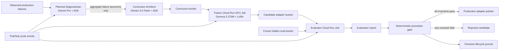

# Nightwatch target architecture

This diagram is the target cloud architecture, not a claim that every component is deployed. Today the local deterministic gate, dataset checks, journal primitive, ADK Curriculum Architect entry point, Gemma training/inference entry points, and trainer container exist. The Diagnostician, orchestration spine, cloud evaluator/promoter, Firestore persistence, and production pointer remain to be implemented.

## Capability boundaries

| Identity | Can read | Can write | Explicitly denied |
|---|---|---|---|
| `nightwatch-diagnostician` | aggregate metrics | diagnosis objects | curriculum and hidden prompts |
| `nightwatch-curriculum` | diagnoses | curriculum bucket | hidden eval bucket and production pointer |
| `nightwatch-trainer` | curriculum bucket, base-model secret | candidate adapter prefix | hidden eval bucket and production pointer |
| `nightwatch-evaluator` | candidate adapters, hidden eval bucket | immutable reports | curriculum bucket and production pointer |
| `nightwatch-promoter` | reports and fixed policy | production pointer, journal | model generation and policy mutation |

Before these are claimed as security boundaries, they must be deployed as separate Cloud Run services/jobs with separate service accounts and verified with denied-access tests. Agent names inside one ADK process are not a security boundary.

## Promotion invariants

The gate promotes only when all conditions hold:

1. Target-suite gain is at least 20 percentage points.
2. Regression-suite accuracy does not decline.
3. No safety-critical case fails.
4. Every frozen case has exactly one valid prediction.
5. Training prompts have no canonical exact overlap with frozen eval prompts.

Gemini can diagnose and propose curriculum. It cannot edit thresholds, scores, evaluation labels, journal history, or the production pointer.
